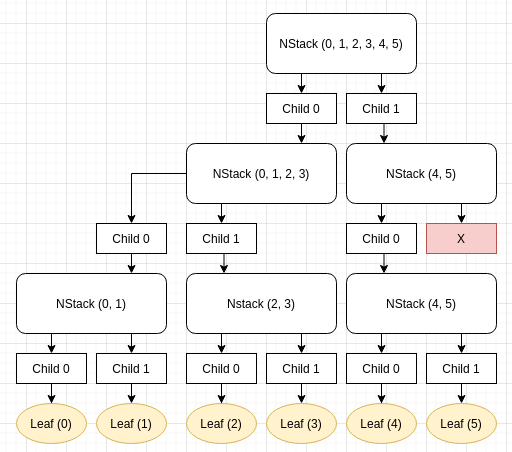

# nstack

Powering the zero knowledge proofs used in dusk network is a particular datastructure called nstack. 

## Guarantees

The leaves in the structure are always the same number of steps away from the root. This is a restraint for reasons of zero knowledge proofs over elements in the collection, which require precomputing circuits for a fixed branch length.

The elements are accessed with the help of the `Nth` annotation-helper from microkelvin.

## Structure

The general structure of `nstack` is a 4-way splitting tree that is always populated from the "bottom left".

As new leaves are added, they get added to the right of the last leaf, creating a new root level on top when neccesary.

The leaves of the tree are always located at the same depth relative to the root.

Here's a representation, using width of 2 instead of 4 for easier visualization.

